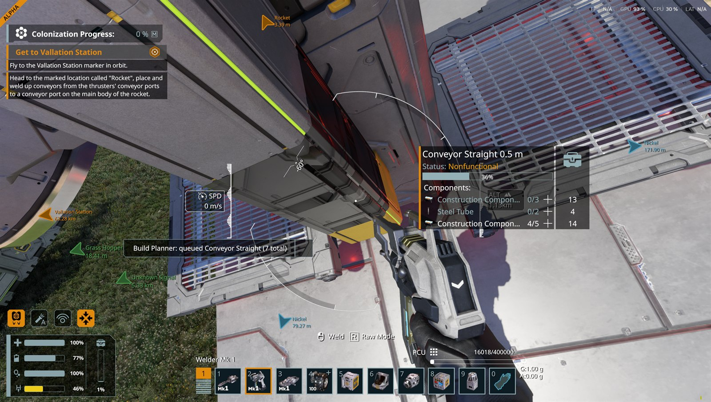
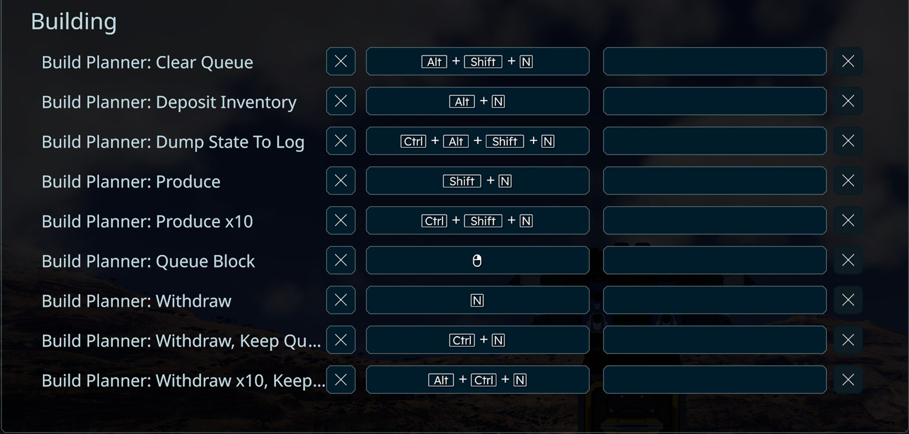
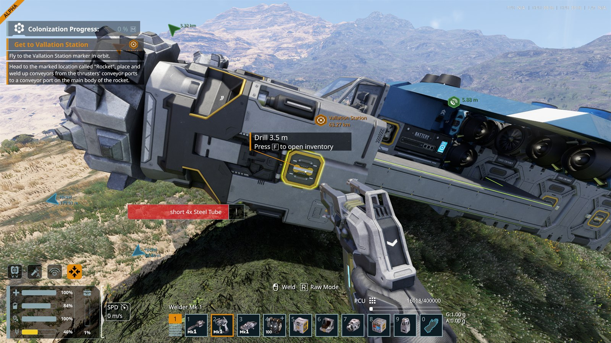
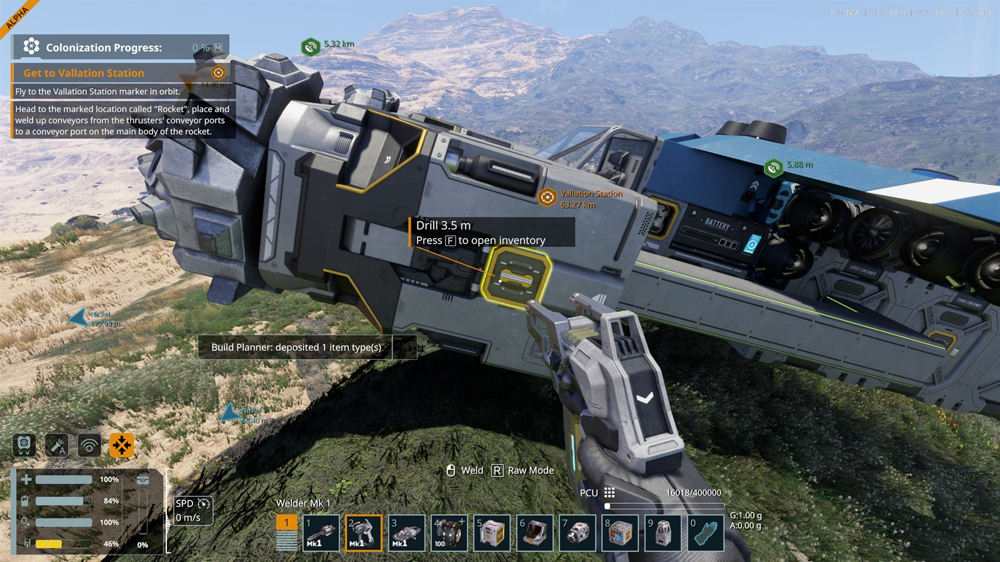

# SE2 Build Planner

Queue up the blocks you're about to build, walk to a container, press one key, and get exactly the
components you're missing. No grabbing whole stacks, no "took 10, needed 11, walk back".

If you played Space Engineers 1, this is the Build Planner / Easy Inventory workflow, rebuilt for
SE2.

This is a **plugin**, not a data mod. You install it with a launch option, and it won't show up in
the in-game mod list.



*Right-click an unfinished block with a welder out and it goes on the queue, with only what it still
needs — this conveyor is 36% built, so it wants the remainder, not a fresh recipe.*

## Install

1. Grab the latest zip from [Releases](https://github.com/viligante8/SpaceEngineers2BuildPlanner/releases).

2. Extract the whole folder somewhere permanent. **Not** inside the game folder, or the next update
   will wipe it. Something like:

   ```
   C:\SE2Mods\BuildPlanner\
   ```

   Keep the files together. `BuildPlanner.dll` needs the MonoMod and Mono.Cecil DLLs next to it.

3. In Steam, right-click Space Engineers 2 → Properties → General → Launch Options, and add:

   ```
   -plugins:C:\SE2Mods\BuildPlanner\BuildPlanner.dll
   ```

   Use your real path. If it has spaces in it, quote the whole thing:

   ```
   "-plugins:C:\My Mods\BuildPlanner\BuildPlanner.dll"
   ```

4. Launch the game. If it worked, the log says `BuildPlanner ready.`

To uninstall: delete the launch option and the folder.

## Controls

| Key | What it does |
|---|---|
| Right-click a block, welder out | Queue what that block still needs |
| Right-click a tile in the build menu (G) | Queue that block |
| `N` | Withdraw everything queued |
| `CTRL+N` | Withdraw, keep the queue |
| `ALT+CTRL+N` | Withdraw ×10, keep the queue |
| `ALT+N` | Deposit your inventory |
| `SHIFT+N` | Produce what's missing at a connected assembler |
| `SHIFT+CTRL+N` | Produce ×10 |
| `SHIFT+ALT+N` | Clear the queue |

Everything except the build-menu right-click is rebindable in **Options → Controls → Building**,
listed as "Build Planner: ...". Rebinding survives restarts.



The build-menu one isn't in that list. It's hooked onto the menu's own buttons rather than the input
system, so right-click still clears a toolbar slot the way it always did.

## Using it

**Queueing.** Have a welder out and look at an unfinished block until its panel shows, then
right-click. You'll get a message saying what got queued and how many blocks are in the queue.
Projections work too. If the block is half-welded you only queue the remainder, not a fresh copy of
the whole recipe.

Area welders queue everything they're covering in one go.

**Withdrawing.** Aim at anything plumbed into the conveyor network and press `N`. A container, an
assembler, a conveyor tube, a survival kit, whatever's in front of you. You get the difference
between what you need and what you're already carrying, pulled from everywhere on that network. If
there isn't enough, you get what there is and the queue stays put so you can come back.



*When the network can't cover it you still get what it had, and it tells you what's outstanding —
here, four Steel Tube short.*

**Depositing.** `ALT+N` pushes what you're carrying back into the network. It leaves your tools
alone — only ore, materials and components go. If the nearest container fills up it keeps going into
the next one, and tells you if it ran out of room before you ran out of items.



**Producing.** `SHIFT+N` while looking at an assembler, or anything conveyor-connected to one,
queues up the components you're short of. You don't need to queue the sub-parts. Ask for Steel
Plates at an assembler with no iron and the game raises the ingot and ore jobs itself.

Producing never clears your queue. The parts don't exist yet, so you still need to come back and
withdraw them.

**Seeing the queue.** Open any terminal and there's a Build Planner box in the bottom right listing
what you've queued. Left-click a block to produce just that one, right-click to drop it from the
queue.

Fun detail: that panel is Keen's. They built the whole thing and shipped it switched off. This mod
just turns it on and feeds it.

## A word of caution

That launch option tells the game to load a DLL, which then runs with the same access to your
machine as the game itself. That's true of this mod, and of every code mod, from anyone.

**Don't take my word for it that it's harmless, and don't make a habit of trusting random uploads.**
Everything below is a claim until you check it. Fortunately checking is easy:

- The whole source is this repository, and the tag matching your download builds it. It's about
  7,000 lines and the interesting parts are a few hundred.
- Any .NET assembly decompiles back to readable C#. Open `BuildPlanner.dll` in a free decompiler
  like [ILSpy](https://github.com/icsharpcode/ILSpy) and read what it actually does — mine included.
- Or build it yourself and run that instead of my download.

[SECURITY.md](SECURITY.md) walks through all three, with the exact commands and SHA-256 hashes for
every bundled DLL.

### What it does, for when you check

No network connections. No processes started. No registry. It writes its own log, adds its nine
bindings to your control options like any other rebindable key, and moves items around your world,
which is the entire point. It doesn't open your saves, read your screenshots, or go anywhere else.

**Your antivirus might grumble.** Changing game code in memory needs the same Windows calls an
injector uses. Those live in MonoMod, the patching library most .NET game mods are built on;
`BuildPlanner.dll` itself has zero native calls. The download isn't code-signed either, so
SmartScreen may complain.

## Known limits

**You have to be close enough to see the block panel.** Sometimes that means crouching for
floor-level blocks. Queue range is tied to your welder's reach, and the engine treats that as one
shared setting, so stretching it would also stretch how far you can weld. Not worth a gameplay
change for a bit of convenience.

**Produce ×10 and the clear-queue chord haven't been tested on their own.** They run the same code
as the actions that have been, so this is a testing gap rather than a known bug.

## When something goes wrong

The log lives here:

```
%APPDATA%\SpaceEngineers2\BuildPlanner\BuildPlanner.log
```

Every action writes a line, and so does every refusal, with the reason. If a key seems dead, the log
will say why. Include it in bug reports, and note that its first line has the version.

It's reasonably chatty, because a restart plus a world load costs about five minutes and a run that
failed to record something is worse than a slightly bigger file. It caps itself at 4 MB and keeps
one previous file, so it can never take more than 8 MB no matter how long you play. Expect a few
tens of KB per session.

Quieten it further with an empty file next to it:

```
%APPDATA%\SpaceEngineers2\BuildPlanner\quiet
```

There's an opt-in one too:

```
%APPDATA%\SpaceEngineers2\BuildPlanner\trace-input
```

That switches on the game's own input tracing, which logs every key the game accepts or throws away,
plus this mod's own blow-by-blow of claiming and releasing right-click. Handy when a binding does
nothing, and noisy enough that it's off unless you ask for it.

**Filing a bug?** Press `SHIFT+ALT+CTRL+N` first, then send the log. That dumps the current state:
what's queued, which assemblers and containers it can actually reach, and what block it thinks
you're looking at. It usually shows the problem outright, and it saves a round of back-and-forth.

**After a game update.** This mod patches game methods by name, so a Keen patch can break it. Check
the log for a hook that failed to install, then look for a newer release.

## Building it yourself

You need Space Engineers 2 installed, since it compiles against the game's own DLLs.

```
dotnet build -p:GameDir="F:\SteamLibrary\steamapps\common\SpaceEngineers2\Game2"
```

Close the game first, or the build can't overwrite `bin\BuildPlanner.dll`.

There are 67 unit tests (`dotnet test`) covering the parts that can be checked without launching:
component totals, shortfall maths, the ×10 multiplier, queue removal, and notification formatting.
They can't tell you the mod works. Nearly every real bug here was a fact about the live engine and
would have sailed through a green test run, so the actual test procedure is
[notes/in-game-tests.md](notes/in-game-tests.md).

`RELEASING.md` covers cutting a release, and why there's no CI.

## Under the hood

Almost nothing about SE2 plugin modding is documented publicly, so what was worked out along the way
is written down in [notes/](notes/):

- How the client and server halves of a session differ, and why only one of them has your inventory
- The engine APIs this leans on, and the three wrong turns before them
- Why conveyor reach isn't what the obvious property says it is
- Keen's hidden terminal panel and what's missing from it

[CHANGELOG.md](CHANGELOG.md) has the version history.

## License

MIT, see [LICENSE](LICENSE). MonoMod, Mono.Cecil and iced are MIT too.

No Space Engineers 2 files are included or redistributed. It builds against your own copy of the
game.
